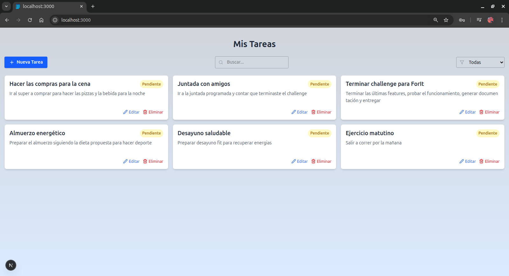
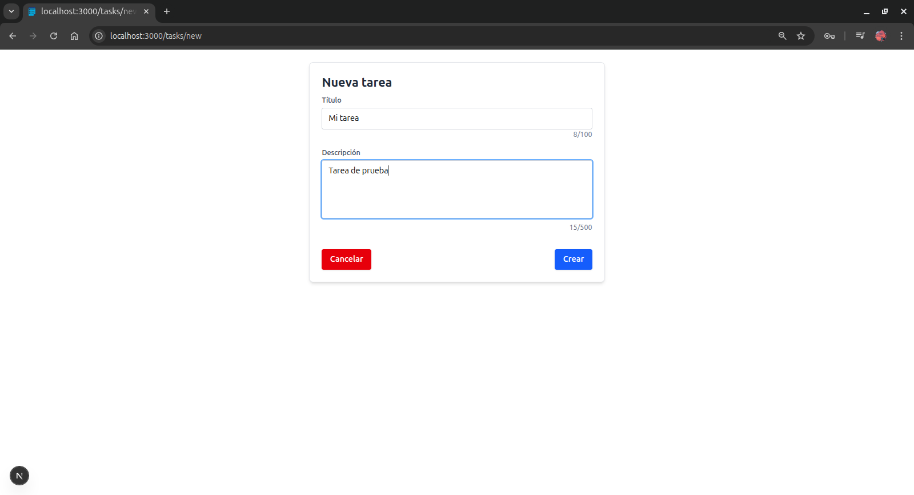
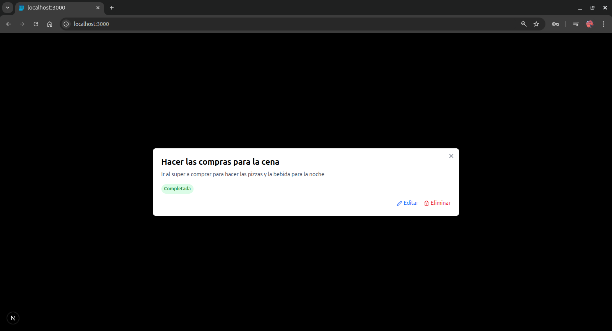
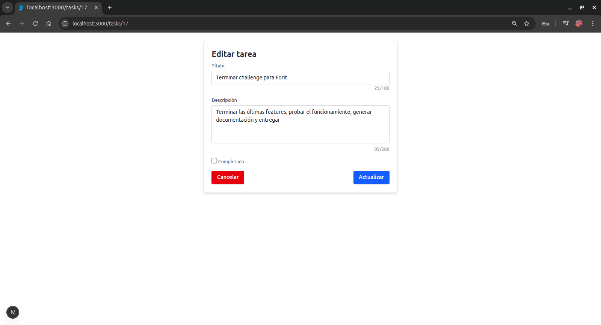
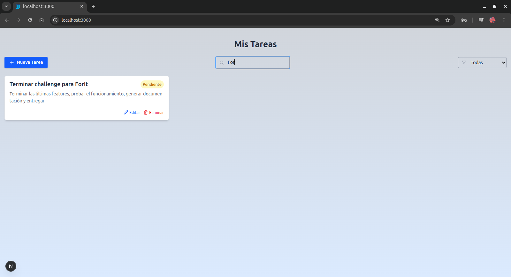
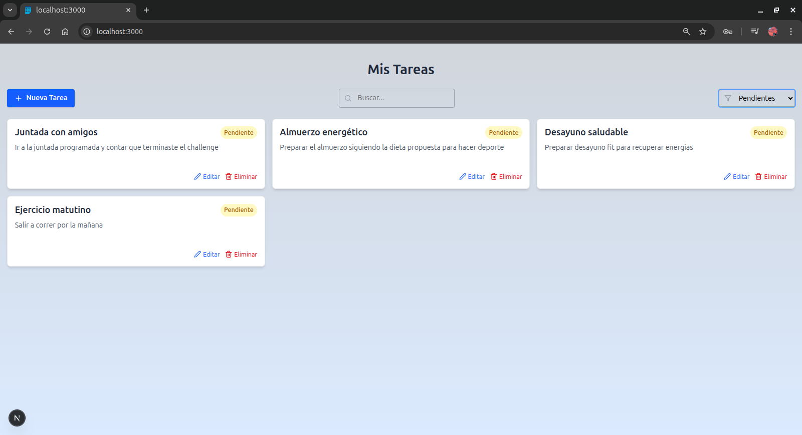
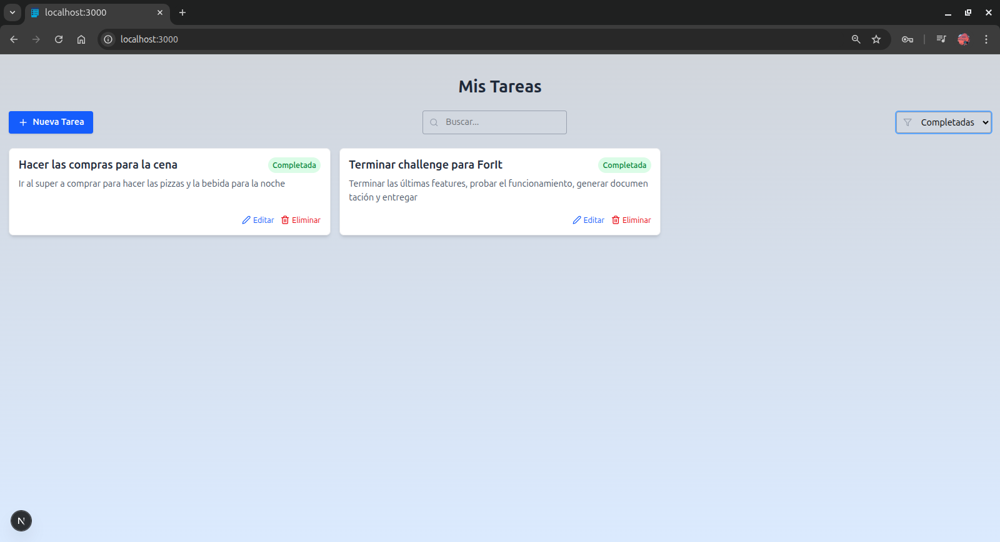

# Task-List
***Lista de tareas***, challenge para Academia ForIT 2025

## Setup

1. Primero debemos clonar el repositorio

    `git clone git@github.com:blasichea/Task-List.git`

2. Ingresamos al directorio del proyecto

    `cd Task-List/taskslist`

3. Instalamos las dependencias

    `npm install`

4. Ejecutamos las migraciones de base de datos

    `npx prisma generate`  
    `npx prisma migrate dev --name init`

5. Ejecuta la aplicación

    `npm run dev`

Se iniciará el servidor. Accesible en: (puede variar el puerto)  
[http://localhost:3000](http://localhost:3000)

## Interface
Vistas de la aplicación:  
Podemos ver cómo la aplicación lista las tareas en forma responsive.  
  
Permite **crear** nuevas tareas,  
  
visualizarlas en un **modal**,  
  
**editarlas** y **eliminarlas**.  
  
También está la opción de realizar **busquedas**  
  
filtrarlas por su estado de **pendiente**  
  
o **completada**.  
  

## Material consultado
* Página de NextJS, documentación y tutoriales  
https://nextjs.org/

* Pagina de Tailwind, documentación  
https://tailwindcss.com/

* Página de Prisma, documentación de ORM  
https://www.prisma.io/

## Branching
Se utilizó una estructura de 2 ramas principales **main** y **dev**  
**Main** es la rama que contiene la versión lista para producción.  
**Dev** es la rama sobre la que trabajan los desarrolladores.  
Luego se desprenden ramas de **dev** por cada feature a desarrollar y se vuelve a unir a **dev** otra vez. Las ramas no se borraron para que se notara el modo de trabajo simulando un entorno de equipo.

## Deployment
Hay una versión de la app alojada en Vercel con base de datos MySQL alojada en Clever cloud.  
https://taskslist-gir7l78kk-blasicheas-projects.vercel.app/

***Tener en cuenta que los servicios son gratuitos y pueden tener demoras***